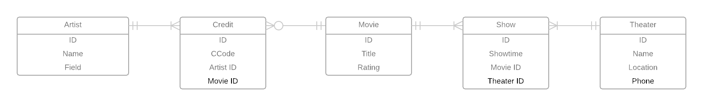

# Data Modeling Notes
  Datasheet(TName, Location, Phone, MTitle, Showtime, Rating, CCode, CName)
# Nomalization Analysis

  #### 1NF Conversion
  TName --> (Location, Phone)
  MTitle --> (Rating)
  MTitle --> --> (CCode, CName)
  (TName, Showtime) --> MTitle
  Theaters(TID, Location, Phone)
  Movies(MID, MTitle, Rating)
  Shows(SID, TID, Showtime, MID)
  Credits(CID, MID, CName, CCode)
  Artists(AID, Name, Bio)

  #### 2NF Conversion

  ##### 3NF Conversion

  #### BCNF Conversion

# Entity Relationship Model
 
